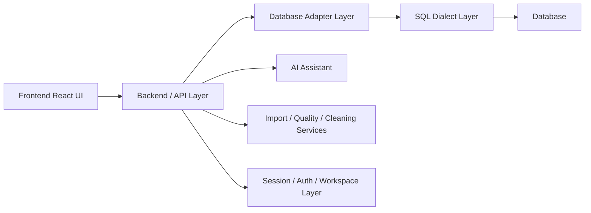

# DataPilot — AI Data Analysis Workspace

## 1. Project Overview

DataPilot is a full-stack data analysis workspace built to help users connect to databases, inspect schema, ask analytical questions in natural language, write SQL, profile data quality, clean messy datasets, and turn results into visual stories and reports.

The project addresses a common workflow problem: analysts and data users often move between database tools, spreadsheet workflows, API tooling, and BI tools just to answer one business question. DataPilot brings these pieces into a single workspace so users can connect to a database, inspect the schema, generate or validate SQL, review data quality, and create analysis artifacts without leaving the same system.

It is designed for analysts, data workers, engineers, product teams, and technical users who need a practical way to explore connected data sources and imported datasets. The project was built to reduce the friction between raw data access and useful analysis by combining SQL, AI assistance, data profiling, cleaning workflows, and dashboards in one interface.

The main value proposition is straightforward: DataPilot provides a single environment for data discovery, SQL-based analysis, AI-assisted query generation, dataset quality review, cleaning, visualization, and collaboration around analytical work.

---

## 2. Key Capabilities

The following capabilities are implemented in the current repository and are reflected in the application code and API routes.

- SQL Workspace
  - The application includes a SQL workspace, editor tabs, query execution flow, and database-aware analysis panels.
  - Evidence: `src/App.tsx`, `src/components/Editor/SqlWorkspace.tsx`, `src/components/Editor/SqlEditor.tsx`, `server/api/queryRoutes.ts`.

- SQL Editor
  - The app includes a multi-feature SQL editor with syntax and autocomplete support, tab management, snippet insertion, and query execution.

- SQL autocomplete and smart suggestions
  - A dedicated SQL autocomplete utility and editor component exist for suggestions based on table and schema context.
  - Evidence: `src/utils/sqlAutocomplete.ts`, `src/components/Editor/SqlAutocomplete.tsx`.

- Multiple SQL tabs
  - The editor supports tabbed SQL workspaces for multiple open queries.
  - Evidence: `src/components/Editor/SqlEditorTabs.tsx` and `SqlWorkspace.tsx`.

- Saved queries / Query Library
  - The application exposes a query library model and saved-query persistence in the collaboration store.
  - Evidence: `server/database/CollaborationStore.ts`, `src/components/Editor/QueryLibraryModal.tsx`.

- SQL templates/snippets
  - Snippet library support is implemented for reusable query fragments and templates.
  - Evidence: `src/components/Editor/SnippetLibraryModal.tsx`, `src/hooks/useSnippets.ts`.

- Query history
  - Query history support is present in the editor and result-analysis workflow.
  - Evidence: `src/types/database.ts`, `src/App.tsx`.

- SQL formatting
  - The workspace includes SQL formatting and syntax-aware editor support; some formatting helpers are used in the editor and validation flow.

- SQL explanation
  - AI SQL explanation is implemented through the AI assistant service and API routes.
  - Evidence: `server/ai/AiAssistantService.ts`, `server/api/aiRoutes.ts`.

- Query performance analysis
  - The project includes a performance analyzer modal and query plan parsing support.
  - Evidence: `src/components/Editor/PerformanceAnalyzerModal.tsx`, `server/services/PerformanceJobManager.ts`.

- Data lineage
  - A lineage workspace exists and relationship-based lineage analysis is implemented.
  - Evidence: `src/components/Lineage/DataLineageWorkspace.tsx`, `server/database/RelationshipDiscovery.ts`.

- Relationship analysis
  - Database metadata and relationship discovery are implemented to map foreign keys and joins.
  - Evidence: `server/database/SchemaIntrospection.ts`, `server/database/RelationshipDiscovery.ts`.

- Join path discovery
  - Join-path utilities exist for mapping paths between tables based on discovered relationships.
  - Evidence: `src/components/Lineage/joinPathUtils.ts`.

- AI Data Assistant
  - The project includes a Gemini-backed AI assistant for natural-language SQL generation, SQL explanation, result explanation, dashboard planning, and data quality recommendations.
  - Evidence: `server/ai/AiAssistantService.ts`, `server/ai/geminiClient.ts`, `server/api/aiRoutes.ts`.

- Database schema discovery
  - Live schema introspection and relationship discovery are implemented for connected databases.
  - Evidence: `server/database/SchemaIntrospection.ts`, `server/database/PostgreSQLAdapter.ts`, etc.

- Read-only SQL protection
  - The project explicitly enforces read-only queries and blocks destructive statements.
  - Evidence: `server/database/QuerySafetyValidator.ts` and `server/api/queryRoutes.ts`.

- Multi-database support
  - Supporting adapters exist for PostgreSQL, SQLite, MySQL, SQL Server, and Oracle.
  - Evidence: `server/database/DatabaseAdapterFactory.ts` and database adapter files.

- CSV/XLSX/JSON import
  - File validation and import pipelines support CSV, Excel/XLSX, and JSON files.
  - Evidence: `server/api/importRoutes.ts`, `server/import/CsvParser.ts`, `server/import/ExcelParser.ts`, `server/import/JsonParser.ts`.

- Unified Data Layer
  - Imported datasets are registered inside an in-memory SQLite-backed unified data layer that makes them queryable like database tables.
  - Evidence: `server/import/UnifiedDataLayer.ts`.

- Data profiling
  - The project profiles dataset structure, distribution, nulls, duplicates, outliers, and quality signals.
  - Evidence: `server/import/DataProfiler.ts`, `server/services/DataQualityService.ts`.

- Data quality analysis
  - Data quality scoring, issues, and remediation guidance are implemented.
  - Evidence: `server/services/DataQualityService.ts` and UI workspace components.

- Data cleaning
  - Data cleaning pipelines and transform previews are implemented.
  - Evidence: `server/services/DataCleaningService.ts`, `src/utils/dataCleaningEngine.ts`.

- Data transformation
  - Transformation pipeline support is present for dataset cleaning and refinement.
  - Evidence: `src/types/cleaning.ts`, `server/services/DataCleaningService.ts`.

- Outlier detection/remediation
  - Outlier detection and handling are included in the data quality and cleaning pipeline.
  - Evidence: `server/services/DataQualityService.ts`, `src/utils/dataCleaningEngine.ts`.

- Data pipelines
  - Pipeline persistence and execution are implemented in the collaboration and cleaning models.
  - Evidence: `server/database/CollaborationStore.ts`, `src/types/cleaning.ts`.

- Visualization
  - The app includes charting workflows and visualization components for query results and datasets.
  - Evidence: `src/components/Visualization/VisualizationWorkspace.tsx`, `src/services/dashboardService.ts`.

- Dashboards
  - Dashboard creation and management are implemented in the app and persistence layer.
  - Evidence: `src/components/Dashboard/DashboardWorkspace.tsx`, `server/database/CollaborationStore.ts`.

- Reports
  - Reports and report snapshots are implemented with workspace/project scopes and execution metadata.
  - Evidence: `server/api/reportRoutes.ts`, `src/components/Collaboration/ReportsWorkspace.tsx`.

- Workspace/project management
  - Workspaces, projects, membership, RBAC, and project switching are implemented.
  - Evidence: `server/database/CollaborationStore.ts`, `server/api/workspaceRoutes.ts`, `server/api/projectRoutes.ts`.

- Authentication
  - Registration, login, session handling, logout, and auth middleware are implemented.
  - Evidence: `server/api/authRoutes.ts`, `server/middleware/authMiddleware.ts`.

- Email verification
  - Email verification tokens and verification lifecycle are implemented.
  - Evidence: `server/services/email/EmailService.ts`, `server/database/CollaborationStore.ts`.

- Password reset
  - Password reset flow and token handling are implemented.
  - Evidence: `server/api/authRoutes.ts`, `server/database/CollaborationStore.ts`.

- RBAC / roles and permissions
  - Role-based permissions are implemented with workspaces and resources.
  - Evidence: `server/services/PermissionService.ts`, `src/types/collaboration.ts`.

- Sharing/collaboration
  - Resource sharing, workspaces, activity, and notifications are present.
  - Evidence: `server/api/shareRoutes.ts`, `server/api/activityRoutes.ts`, `server/api/notificationRoutes.ts`.

- Audit/activity features
  - Audit logs and activity tracking are implemented.
  - Evidence: `server/utils/auditLogger.ts`, `server/database/CollaborationStore.ts`.

- Notifications
  - Notification records and views are implemented.
  - Evidence: `server/api/notificationRoutes.ts`, `server/database/CollaborationStore.ts`.

- Docker
  - Dockerfile and Docker Compose configuration are present.
  - Evidence: `Dockerfile`, `docker-compose.yml`.

- Database migrations
  - SQLite-based migration runner and versioned migrations are included.
  - Evidence: `server/migrations/MigrationRunner.ts` and `server/migrations/versions/`.

- CI/CD
  - GitHub Actions workflows for CI and deployment are present.
  - Evidence: `.github/workflows/ci.yml`, `.github/workflows/docker.yml`, `.github/workflows/production.yml`, `.github/workflows/staging.yml`.

- Health/readiness checks
  - Health and readiness endpoints are implemented in the Express server.
  - Evidence: `server.ts`.

---

## 3. Supported Databases

The repository contains explicit database adapters for the following engines:

- PostgreSQL
  - Implemented in `server/database/PostgreSQLAdapter.ts`.
  - Factory registration exists in `server/database/DatabaseAdapterFactory.ts`.

- SQLite
  - Implemented in `server/database/SQLiteAdapter.ts`.
  - Important for local development and embedded/offline use cases.

- MySQL
  - Implemented in `server/database/MySQLAdapter.ts`.

- SQL Server
  - Implemented in `server/database/SQLServerAdapter.ts`.

- Oracle
  - Implemented in `server/database/OracleAdapter.ts`.

Database-specific SQL dialect handling matters because each engine differs in syntax, quoting, pagination, date formatting, and metadata queries. For example, PostgreSQL uses `LIMIT`, SQL Server uses a different pagination pattern, SQLite uses a lightweight `PRAGMA`-based approach, and Oracle has its own metadata and quoting behavior. This project addresses that by using a shared adapter interface and a dialect abstraction layer, allowing the application to normalize metadata and issue database-specific SQL while keeping the rest of the application logic consistent.

The architecture is intentionally adapter-based:

- `DatabaseAdapter` defines the common contract for connection, introspection, schema discovery, and read-only query execution.
- `DatabaseAdapterFactory` selects the implementation by database type.
- `SqlDialect` provides dialect-specific formatting helpers for identifiers, table qualification, date values, pagination, and explain output.
- Each database adapter implements its own `getDialect()` while exposing the same capabilities interface to the rest of the application.

This keeps the SQL workspace and AI assistant logic schema-aware without hard-coding a single database syntax.

---

## 4. Architecture

The system is a layered full-stack application with the following flow:



### Frontend

The frontend is a React + TypeScript interface. It includes database explorer, connection modal, SQL editor, analysis studio, visualization workspace, dashboard workspace, quality workspace, cleaning workspace, lineage view, collaboration widgets, and auth pages.

### Backend/API

The backend is an Express server with route modules for connections, schema discovery, query execution, imports, AI actions, quality analysis, cleaning, auth, workspaces, reports, notifications, activity, and audits. This is implemented in `server.ts` and the files under `server/api`.

### Database Adapter Layer

The database layer centralizes connection management and adapter implementations. `ConnectionManager` holds active session-scoped database connections. `DatabaseAdapterFactory` creates the correct adapter for a given database type.

### SQL Dialect Layer

`SqlDialect` abstracts differences in quoting, pagination, table qualification, date formatting, and `EXPLAIN` output. Each adapter defines its own dialect to maintain compatibility across PostgreSQL, MySQL, SQL Server, SQLite, and Oracle.

### Database

The actual target database system is the live SQL engine behind the adapter. The project also uses SQLite-backed local stores for session-in-memory datasets and collaboration metadata.

### Schema metadata normalization

The application normalizes database metadata through adapter methods like `listTables()`, `getTableDetails()`, `getPrimaryKeys()`, `getForeignKeys()`, and `getRelationships()`. This makes schema discovery consistent regardless of the underlying database engine.

### Adapter factory / registry

The factory pattern is used to choose the correct adapter by type, while the connection manager tracks the active session connection. This helps keep connection state per user session and isolates database access.

### Read-only guard

The `QuerySafetyValidator` enforces a strict read-only model. It rejects multiple statements, destructive DDL/DML, dangerous functions, and administrative commands. All execution routes validate the SQL before running it.

### Connection isolation

Each session can have its own active database connection, tracked by `sessionId`, which prevents active DB state from being globally shared across sessions.

### Query execution

Query execution goes through adapter methods and is validated before SQL is sent. Result sets are returned with metadata such as columns, rows, row count, and truncation information.

### Authentication/session layer

Auth is implemented through Express middleware and a SQLite-backed collaboration store. Sessions, login state, roles, workspaces, and permissions are managed server-side.

### Migration layer

The project includes a migration runner and a set of migration files under `server/migrations/versions` to evolve the collaboration data schema safely.

---

## 5. Technology Stack

The actual stack used in this repository is as follows.

### Frontend

- React
- TypeScript
- Vite
- Tailwind CSS
- Lucide icons
- Recharts
- `@xyflow/react` for graph/lineage visuals

### Backend

- Node.js
- Express
- TypeScript
- Server-side route modules under `server/api`
- Session and auth middleware

### Database

- PostgreSQL driver (`pg`)
- MySQL driver (`mysql2`)
- SQL Server driver (`mssql`)
- Oracle driver (`oracledb`)
- SQLite (`sqlite` and `sqlite3`)
- Native SQLite `node:sqlite` usage for local/session metadata and imported datasets

### AI

- Google Gemini integration via `@google/genai`
- Server-side AI assistant features for SQL generation, explanation, dashboard planning, and data-quality recommendations

### Data processing

- Data imports and parsing for CSV, XLSX, and JSON
- Unified Data Layer using in-memory SQLite tables for imported datasets
- Data profiling and quality scoring
- Data cleaning transformation engine

### Visualization

- Recharts for chart rendering
- Dashboard widgets and reporting interfaces
- Data visualization workspace and chart configuration types

### Authentication/security

- Session cookies
- Password hashing using crypto primitives
- Email verification tokens
- Password reset tokens
- Role permissions and middleware
- Strict read-only SQL validation
- Audit logging

### Testing

- TypeScript checks via `tsc --noEmit`
- `tsx` test runner and many dedicated test suites under `tests/`
- Adapter and DB-focused tests
- Security validation tests
- Migration tests
- Quality and import integration tests

### DevOps/deployment

- Dockerfile
- Docker Compose
- GitHub Actions workflows
- Production build scripts and health endpoints
- Environment configuration via `.env.example` and Docker environment files

---

## 6. SQL/Data Analysis Features

A user can work through the system in the following way:

1. Connect a database
   - The application opens a database connection through the connection flow and stores the connection per session.
   - The UI provides a connection modal and the backend exposes `/api/database/connect` and related routes.

2. Discover tables
   - The adapter introspects table metadata, schema information, and relationships. The UI displays discovered tables and table details.

3. Inspect schema
   - The schema layer exposes table columns, foreign keys, indexes, and relationship information to support query building and analysis.

4. Write SQL
   - The SQL editor allows users to type, edit, save, and execute queries. Multi-tab editing is supported.

5. Use autocomplete
   - The editor includes a suggestion engine with table and schema-aware completions for SQL statements.

6. Execute read-only queries
   - Query execution is validated by the server-side `QuerySafetyValidator` before execution. Only read-only queries are allowed.

7. Analyze results
   - The results display can show row data and supports AI explanation and performance analysis workflows.

8. Visualize results
   - Result sets can be mapped to charts and dashboards in the visualization workspace.

9. Save queries
   - Saved query support is implemented and persisted through the collaboration store.

10. Build dashboards/reports
   - The project includes dashboard and report management, with per-workspace and per-project scopes.

---

## 7. AI Data Assistant

The AI assistant is a server-side feature that uses schema-aware metadata to generate read-only analytical SQL from natural language questions.

Key behaviors:

- Natural-language data questions
  - Users can ask questions in plain language and the assistant converts them into SQL.

- Schema-aware SQL generation
  - The AI service builds a schema context and validates the generated SQL against actual database metadata.

- Relationship-aware query generation
  - The assistant is aware of discovered tables and relationships and tries to generate queries referencing real schema relationships.

- SQL review/safety
  - Generated SQL is checked by the safety validator before it is executed. Dangerous or non-read-only SQL is rejected.

- Read-only analytical workflow
  - The design is intentionally centered on analytical reads and query explanations rather than data modification.

Important: generated SQL is grounded against available schema metadata. The repository explicitly includes validation against real tables and columns, and the assistant will reject or retry when the generated query does not match the actual schema.

---

## 8. Data Quality & Cleaning

The repository implements a data quality and cleaning workflow with profile-based diagnosis and transformation steps.

The implemented workflow includes:

- profiling
  - Data profile generation for tables and imported datasets

- missing values
  - `DataQualityService` and `DataProfiler` assess missing values and empty/whitespace cases

- duplicates
  - Duplicate row detection and percentage calculations are included

- invalid dates
  - Date validation and future-date checks are part of the quality scoring

- type inconsistencies
  - Data type consistency is evaluated in the quality profile

- numeric quality
  - Numeric distribution, zero values, negative values, and outliers are tracked

- text cleaning
  - Cleaning service supports string normalization and text manipulation steps

- case normalization
  - Case-related transformations are part of the cleaning pipeline model

- value mapping
  - The transformation pipeline supports mapping-like cleaning operations

- transformations
  - Cleaning pipeline steps are modeled and previewed before execution

- outlier detection
  - Outlier detection is included in quality and cleaning workflows

- remediation
  - Data quality issues and transformation steps provide remediation options

- pipeline execution
  - Cleaning previews and pipeline execution are implemented in the service layer

Important safety model:

The source database remains protected by strict read-only query validation. Cleaning and profiling operate on dataset snapshots or imported session copies rather than allowing destructive writes to the original source database. This is an explicit design safety pattern in the repository.

---

## 9. Data Import

The app supports importing CSV, Excel/XLSX, and JSON files.

### Import behavior

- CSV support
  - Parses uploaded CSV files and validates them.

- Excel/XLSX support
  - Reads workbook sheets and supports selected-sheet import flows.

- JSON support
  - Accepts JSON arrays or structured objects that can be parsed into row-oriented datasets.

### Import workflow

- preview
  - Uploads are validated and previewed before confirmation

- profiling
  - Imported datasets are profiled using the unified profiler

- validation
  - File-type checks, size checks, and shape validation are enforced

- imported dataset handling
  - Imported datasets are added to the unified data layer and then surfaced in the discovery and query experience like a source table

- analysis/visualization integration
  - Imported datasets can be used in the analysis, visualization, dashboard, and quality tooling

- export capabilities
  - The repository includes export support for CSV, JSON, and XLSX data output flows

---

## 10. Visualization & Dashboards

The visualization layer is an actual feature area in the app and includes charting, field mapping, dashboard building, and report generation.

Implemented areas include:

- chart configuration and result plotting
- dashboard workspace UI
- widgets and filters
- report generation from dashboard content
- KPI-style summaries and narrative insights
- dataset-to-visualization flow for both imported and database-backed data

The application supports turning query results into visualized outputs, then promoting them into dashboards and reports. This is implemented across the visualization components, dashboard service, and collaboration/report persistence layers.

---

## 11. Authentication & Security

The current repository implements the following authentication and security features.

- registration/login
  - User registration and login flow are implemented in `server/api/authRoutes.ts`

- password hashing
  - Passwords are stored with hashing and salt-based patterns in `CollaborationStore`

- sessions
  - Session tokens are created and tracked in the collaboration store

- logout
  - Auth flows and session handling support sign-out behavior

- password reset
  - Password reset tokens and reset flows are implemented

- email verification
  - Registration includes verification token generation and user verification lifecycle

- verification token hashing
  - Tokens are hashed before storage; raw tokens are used transiently for the verification URL

- token expiry
  - Verification and reset tokens include expiry timestamps

- rate limiting
  - Auth-related endpoints have rate-limit handling

- RBAC
  - Roles and permissions are implemented through `PermissionService` and workspace membership logic

- authorization middleware
  - `requireAuth`, `requirePermission`, and `requireVerifiedEmail` guard routes and actions

- read-only database protection
  - `QuerySafetyValidator` blocks destructive operations and restricts execution to read-only analytical queries

- environment secrets
  - `.env.example` and the app startup validation clearly separate required production env vars from local defaults

- audit logging
  - Audit and activity records are persisted and exposed via API routes

Security design decisions in the repo include:

- environment validation for production settings such as `DATABASE_URL` and `SESSION_SECRET`
- request correlation IDs for auditing
- minimal logging of sensitive values
- cookie-based session handling
- server-side validation and guard middleware
- strict rejection of non-read-only SQL

---

## 12. Workspace & Collaboration

The project includes a collaboration layer for teams working inside a shared analytical space.

- workspaces
  - Workspace objects, membership, and security boundaries are implemented

- projects
  - Projects are created and scoped within workspaces

- members
  - Workspace membership records and role assignments are tracked

- roles
  - User roles include OWNER, ADMIN, EDITOR, ANALYST, and VIEWER

- permissions
  - Fine-grained permission mappings are defined for workspace, data, query, dashboard, and report actions

- sharing
  - Resource-sharing logic and share access are present in the collaboration model

- reports
  - Report creation, updates, snapshots, and retrieval are supported

- activity/audit
  - Activity events and audit logs record key actions across the workspace

- notifications
  - Notification records allow alerts for system and workspace actions

This is a meaningful collaboration layer, but it is still implemented as a local SQLite-backed collaboration store and not a full distributed multi-tenant enterprise platform.

---

## 13. Production & DevOps

The repository includes a real production-oriented deployment setup.

- environment configuration
  - `.env.example` and `.env.docker.example` show the expected runtime settings

- migrations
  - `server/migrations/MigrationRunner.ts` handles schema evolution for collaboration data

- Docker
  - `Dockerfile` creates a multi-stage Node image for build and runtime

- Docker Compose
  - `docker-compose.yml` sets up a PostgreSQL service and the app service

- health checks
  - `/api/health`, `/api/health/live`, and `/api/health/ready` are implemented

- readiness checks
  - Container health checks point to the readiness endpoint

- GitHub Actions
  - CI workflows exist under `.github/workflows`

- CI/CD
  - The workflow installs dependencies, validates migrations, runs type checks, executes tests, and builds the bundle

- production build
  - `npm run build` creates the frontend and backend bundles

- deployment configuration
  - Production/staging environment configuration is surfaced in the repo and workflow files

---

## 14. Testing & Quality Assurance

The repository contains a broad automated test suite under `tests/` and a test runner script. The actual setup is substantial and includes multiple categories.

The repository includes automated tests for:

- unit/integration/regression tests
  - Many suites are defined in `tests/runAllTests.ts`

- database adapter tests
  - Adapter validation and connection tests exist

- security tests
  - SQL security validation tests are included

- authentication tests
  - Real auth, password reset, and email verification flows are tested

- migration tests
  - Migration validation and migration behavior are covered

- build/type checking
  - `npm run lint` runs TypeScript validation

- CI validation
  - GitHub Actions runs migration validation, TypeScript checks, tests, and a production build

The repository does not expose a single verified total test count in a simple top-level counter, so the document intentionally avoids inventing a number. The code clearly shows a large matrix of specialized automated suites rather than a single small smoke suite.

It is also important to distinguish test modes in the repo:

- automated testing
  - Implemented through `tsx tests/runAllTests.ts` and many suite files

- manual browser/UI testing
  - The project includes UI features and collaboration flows, but the repo does not present a formal browser automation suite as the primary test layer

- live database testing
  - Some adapter and DB connection tests exist and may require real database credentials or services

- external credential environments
  - The README and environment configuration show that AI keys, email configuration, and database endpoints may require external setup values in local or deployment environments

---

## 15. Important Engineering Challenges & Solutions

The repository shows that several real engineering problems were addressed:

- multi-database SQL dialect differences
  - Solved through adapter-specific implementations and a standardized `SqlDialect` interface

- schema/query mismatches
  - Addressed by schema-grounded AI validation and the `SchemaValidator` logic

- read-only database safety
  - Solved through strict SQL validation that blocks mutating statements and multiple statements

- dynamic table discovery
  - Supported by schema introspection and metadata discovery across adapters

- duplicate JOIN columns and relationship mapping
  - Addressed by relationship-aware metadata handling and lineage tooling

- large dataset processing
  - Addressed through chunked data processing, sampling, and performance job management

- dependency/React compatibility
  - The repository includes multiple fixes and compatibility work reflected in the scripts and changelog history

- Node runtime compatibility
  - `package.json` explicitly pins the project to Node `>=22.5.0`, and the Docker build uses Node 22

- migration handling
  - Implemented via versioned migration files and validation checks

- Docker build/runtime issues
  - The Dockerfile and compose files address production-like runtime setup and health checks

- authentication/session lifecycle
  - The auth middleware and sessions store manage login, role resolution, token expiry, and route access

- email verification lifecycle
  - Verification tokens and reset workflows are implemented with expiry and delivery checks

These challenges are consistent with the repository history and code structure and are not abstract claims.

---

## 16. Example User Workflow

A realistic usage flow for the project looks like this:

1. Connect PostgreSQL
2. Discover schema
3. Ask AI question
4. Review generated SQL
5. Execute read-only query
6. Analyze results
7. Visualize
8. Save query
9. Add to dashboard/report

Example flow:

- User connects to a PostgreSQL database and the app establishes a session-scoped connection.
- The schema explorer lists tables and relationships from the connected database.
- The user asks: “Which customers placed the most orders last quarter?”
- The AI assistant builds a schema-aware SQL query based on the actual connected tables and relationships.
- The app validates that the query is read-only and matches the real schema.
- The user reviews the generated query, executes it, and inspects the rows.
- Results can be turned into charts or added to a dashboard.
- The user saves the SQL to the query library and includes the results in a report or dashboard view.

---

## 17. Project Structure

The repository contains the following core structure:

```text
DataPilot/
├── .github/
│   └── workflows/
├── data/
├── docs/
├── public/
├── server/
│   ├── ai/
│   ├── api/
│   ├── database/
│   ├── import/
│   ├── middleware/
│   ├── migrations/
│   ├── services/
│   └── utils/
├── src/
│   ├── components/
│   ├── context/
│   ├── hooks/
│   ├── services/
│   ├── types/
│   ├── utils/
│   └── App.tsx
├── tests/
├── .env.example
├── .env.docker.example
├── Dockerfile
├── docker-compose.yml
├── package.json
├── package-lock.json
├── README.md
├── server.ts
├── tsconfig.json
├── vite.config.ts
├── PROJECT_DOCUMENTATION.md
└── ...
```

---

## 18. Local Development Setup

The following setup is based on the current repository state.

### Prerequisites

- Node.js 22 or newer
- npm
- A working database environment for PostgreSQL, SQLite, MySQL, SQL Server, or Oracle if you want live database testing
- Optional: Gemini API key if you want the AI assistant enabled

### Installation

```bash
npm install
```

### Environment configuration

Copy the example environment file and adjust values as needed:

```bash
cp .env.example .env
```

The repository explicitly notes that `.env` should not be committed to source control. Do not set real credentials in the repo.

### Database configuration

For local development, the app supports:

- SQLite for local or embedded test/dev usage
- PostgreSQL connection details via environment values or the UI connection modal
- Other supported database types through the adapter layer

### Migrations

```bash
npm run migrate:status
npm run migrate:validate
npm run migrate:up
```

### Development server

```bash
npm run dev
```

### Test commands

```bash
npm test
npm run test:adapters
npm run test:dialect
npm run test:security
npm run test:schema
npm run test:lineage
npm run test:analysis
```

### Build commands

```bash
npm run lint
npm run build
```

---

## 19. Security Notes

The repository is designed with explicit security discipline:

- `.env` files should not be committed to Git
- `.gitignore` excludes environment files and sensitive local artifacts
- production settings such as `DATABASE_URL`, `SESSION_SECRET`, and API credentials should be provided in deployment-managed environment variables
- credentials should never be embedded in source code or committed to version control
- the app emphasizes server-side validation and read-only database behavior to reduce common SQL risks

The repository does not print secret values in logs; startup validation explicitly warns on missing production env variables rather than exposing them.

---

## 20. Future Scope

The following are clearly labeled as future ideas and are not current features:

- cloud data warehouses
- additional enterprise integrations
- expanded collaboration and administration workflows
- broader AI analytics capabilities
- managed-cloud deployment patterns

These are not implemented as core features in the current repository and should be treated as future directions rather than present functionality.

---

## 21. Interview Explanation

### How I Explain DataPilot in an Interview

#### 30-second explanation

DataPilot is a data analysis workspace that helps users connect to live databases, inspect schema, write SQL, profile data quality, and turn results into dashboards and reports. It combines database discovery, AI-assisted query generation, cleanup workflows, and visual analysis in one system.

#### 1-minute explanation

I built DataPilot as a practical workspace for people who need to move from raw data to insight without juggling multiple tools. The app lets a user connect to a database, inspect tables and relationships, generate or review SQL, execute read-only queries, profile data quality, clean imported data, and build dashboards. The project also includes AI assistance for natural-language questions and schema-grounded SQL generation, alongside authentication, workspaces, and collaboration features to support shared analytical work.

#### Technical explanation

At the architecture level, DataPilot has a React frontend and an Express backend. The database access layer uses adapter objects for PostgreSQL, SQLite, MySQL, SQL Server, and Oracle, each with a dialect-specific implementation. The app normalizes schema metadata, validates queries using a strict read-only safety layer, exposes schema discovery and relationship analysis, and supports imported datasets through a unified in-memory SQLite data layer. This keeps database logic abstract while still respecting engine-specific SQL differences.

#### Key engineering decisions

- use an adapter + dialect architecture to handle multiple database engines
- keep query execution read-only by design
- validate AI-generated SQL against real schema metadata before execution
- isolate database connections per session
- support imported datasets alongside live database tables within the same analytical workflow

#### Key challenges

- handling dialect differences across databases
- preventing dangerous SQL from being executed
- reconciling schema metadata with AI-generated queries
- supporting large imported datasets and profiling without breaking performance
- keeping collaboration, auth, and workspace isolation coherent in a shared system

#### What I personally learned

This project taught me how much complexity exists between “connecting to a database” and “delivering a useful analytical workflow.” The hardest part was not just the UI; it was building reliable schema awareness, ensuring safety, handling database differences correctly, and keeping the product coherent across SQL, quality analysis, import workflows, and AI-assisted investigation.

---

## 22. Resume/GitHub Summary

### Professional GitHub project description

DataPilot is a full-stack AI data analysis workspace for connecting to databases, exploring schemas, writing and validating SQL, profiling data quality, cleaning imported datasets, and building dashboards and reports from analysis results.

### Resume bullet points

- Built a full-stack SQL and data analysis workspace with live database connections, schema discovery, and read-only query validation.
- Implemented multi-database support across PostgreSQL, SQLite, MySQL, SQL Server, and Oracle using a modular adapter and dialect architecture.
- Added AI-assisted SQL generation grounded in live schema metadata, along with SQL explanation and data-quality recommendations.
- Created import, profiling, data cleaning, and visualization workflows for CSV, Excel, and JSON datasets.
- Designed workspace, project, RBAC, audit, and authentication features to support collaborative analytical work.

### Relevant technical keywords

DataPilot, SQL Workspace, Database Adapters, PostgreSQL, SQLite, MySQL, SQL Server, Oracle, Read-Only SQL, AI Data Assistant, Gemini, Schema Discovery, Data Profiling, Data Cleaning, ETL-like Workflow, Data Quality, Visualization, Dashboards, Reports, RBAC, Authentication, Express, React, TypeScript, Docker, CI/CD, Migrations

---

## Final Note

This documentation reflects the actual implementation present in the current repository as of this review. It intentionally avoids claiming features or readiness levels that are not clearly supported by the code, environment files, and workflows in this project.
